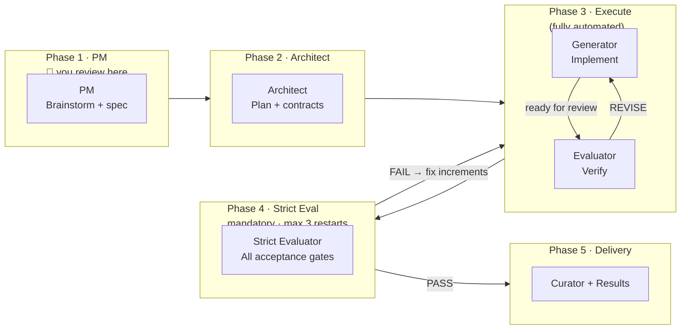
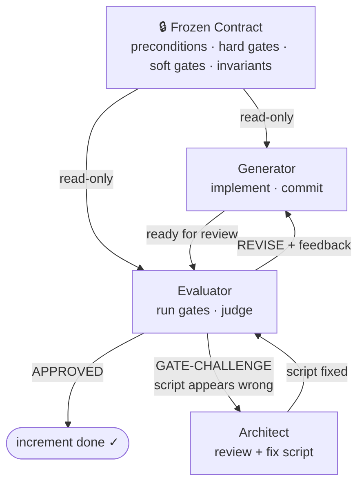
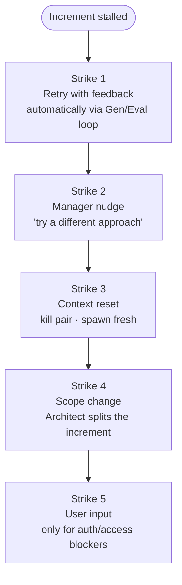

# Superteam

> *You have AI. Why are you still glued to the screen?*

Superteam is a Claude Code plugin that turns a single `/superteam` command into an autonomous multi-agent engineering team. You describe what to build. The team plans, implements, tests, and delivers — while you do something else.

```
/superteam Build a REST API for user authentication with JWT and refresh tokens
```

---

## The Core Insight

> **Agent = Model + Harness. The harness is where reliability lives.**

The same model produces dramatically different outcomes depending on what surrounds it. Superteam is that surrounding structure — the harness that turns a capable model into a *reliable* system.

| Without harness | With harness |
|-----------------|--------------|
| Prompt → hope | Plan → Contract → Implement → Verify → Deliver |
| ~70% success rate | Verification gates catch regressions |
| Quality varies by luck | Adversarial evaluation, not self-review |
| Manual babysitting | Self-healing watchdog + fresh agents per unit |

---

## How It Works

### The Pipeline

Five phases run automatically after you approve the spec:



**Phase 1 (PM)** — The PM agent brainstorms with you, asks clarifying questions, and produces a spec with measurable acceptance gates. You review and approve before anything is built.

**Phase 2 (Architect)** — The Architect decomposes the spec into increments, each with a frozen contract (preconditions, hard gates, soft gates, invariants). A dedicated Gate Author pair writes and tests the verification scripts.

**Phase 3 (Execute)** — The Manager drives a parallel execution loop. Each increment gets a fresh Generator/Evaluator pair. The Generator implements; the Evaluator runs hard gate scripts and issues verdicts. They iterate directly. The Manager monitors for anomalies.

**Phase 4 (Strict Evaluation)** — A fresh Strict Evaluator runs *all* final acceptance gates against the complete deliverable. Binary PASS or FAIL. On FAIL, the Architect writes targeted fix increments and Phase 3 reruns. Maximum 3 attempts before escalating to you.

**Phase 5 (Delivery)** — The Curator extracts reusable knowledge to your global wiki (`~/.superteam/`). Results are presented.

---

### The Agent Roster

| Agent | Lifecycle | Role |
|-------|-----------|------|
| **Team Lead (TL)** | Persistent | Sole user-facing interface. Spawns agents. Owns the approval gate. Runs the watchdog timer. |
| **Orchestrator** | Persistent | Drives phase transitions. Owns `state.json` phase/step. Routes GATE-CHALLENGE, inability, and restart cycles. |
| **PM** | Phase 1 | Brainstorms spec with user. Writes acceptance gates. |
| **Explorer** | Persistent | Surveys the codebase. Seeds the knowledge base. Dispatches research subagents. |
| **Architect** | Persistent | Decomposes spec into contracts. Fixes verification scripts on GATE-CHALLENGE. Inserts exploration increments when agents report inability. |
| **Manager** | Phase 3–5 | Stateless monitoring loop (270s). Detects anomalies. Drives the execution loop. Runs 5-strike escalation. |
| **Curator** | Phase 5 | Session-end knowledge extraction to global wiki. |
| **Generator** | Fresh per increment | Reads frozen contract → implements → pre-validates → commits → requests review. |
| **Evaluator** | Fresh per increment | Reads contract + outputs only (never Generator's reasoning) → runs 4-tier verification → issues APPROVED / REVISE / GATE-CHALLENGE. |

---

### The Generator ↔ Evaluator Loop

The core quality primitive. Two agents, one frozen contract, adversarial feedback:



The Evaluator reads **only** the contract and the Generator's outputs — never the Generator's reasoning. This prevents evaluator anchoring and makes skepticism tractable to tune.

---

### 4-Tier Contract Verification

Every increment is verified against a frozen contract written *before* implementation begins:

| Tier | What | Cost |
|------|------|------|
| **Preconditions** | Scripts that must pass before work starts | 0 LLM tokens |
| **Hard Gates** | Deterministic scripts — binary pass/fail | 0 LLM tokens |
| **Soft Gates** | Evidence-backed LLM review (minimize these) | Low |
| **Invariants** | Universal quality bar — hook-enforced, always run | 0 LLM tokens |

Hard gates are the primary mechanism. Soft gates supplement where judgment is genuinely required.

---

### State Architecture

Three append-safe artifacts coordinate the team:

```
.superteam/
├── state.json               CAS-protected coordination state
│                            phase, active agents, loop counters
│                            mutations via scripts/state-mutate.sh only
│
├── events.jsonl             Append-only event stream
│                            decisions · anomalies · mutations · escalations
│                            written by scripts/record-event.sh
│
└── strict-evaluations.jsonl   Phase 4 verdict log
                               idempotent per cycle · FAIL count drives restart cap
```

The Manager re-reads these files every cycle from scratch — no accumulated context. **History IS the files.**

---

### The 5-Strike Escalation Ladder

When an increment stalls, the Manager escalates. Each strike *changes* the approach:



---

### Failure Recovery

| Failure | Response |
|---------|----------|
| Agent context degraded | Per-unit fresh pairs — degradation is prevented structurally |
| Pipeline stall (20 min) | Watchdog messages Orchestrator; if still stalled, spawns fresh Orchestrator |
| Agent reports inability | Explorer researches; Architect inserts exploration + practice increments |
| Verification script wrong | GATE-CHALLENGE verdict escalates to Architect — not Generator |
| Phase 4 fails | Architect writes targeted fix increments; max 3 restart cycles |
| Architect stuck | Checkpoint/restart (max 2); then escalate to user |

---

## Installation

```bash
# clone into your Claude Code plugins directory
git clone https://github.com/your-username/superteam ~/.claude/plugins/superteam

# or install the inner plugin only
cp -r superteam/superteam ~/.claude/plugins/superteam
```

Superteam requires **Claude Code** with multi-agent (team) support enabled.

---

## Usage

```bash
# start a new engineering session
/superteam Build a rate-limited job queue with Redis and dead-letter support

# use a specific task form
/superteam --form engineering Refactor the auth module to support OAuth 2.0
```

The only step that requires your attention is **spec approval** at the end of Phase 1. After that, the team runs to completion autonomously.

---

## Task Forms

Superteam is form-driven. The active form defines the phase list, inner-loop roles, parallelism, and termination condition.

| Form | Inner loop | Max parallel pairs | Use when |
|------|-----------|-------------------|----------|
| `engineering` | Generator / Evaluator | 2 | Code-centric features, refactors, bug fixes |

Custom forms can be added under `task-forms/{name}/FORM.md`.

---

## Design Philosophy

Ten principles from [`superteam/docs/Design.md`](superteam/docs/Design.md):

1. **Separate generation from evaluation** — self-evaluation is inherently lenient
2. **Context is the scarcest resource** — progressive disclosure, not context dumping
3. **Design the environment, not just the prompts** — add tools and structure, not more words
4. **Incremental, independently verifiable work units** — contracts define "done" before work starts
5. **Per-unit freshness** — spawn fresh pairs; replace, don't compact
6. **File-based artifacts as source of truth** — state survives context resets
7. **Active verification over passive review** — run tests, don't just read code
8. **Codify expert knowledge as system rules** — encode the senior review into the gates
9. **Self-evolving systems** — the Curator promotes session findings to the global wiki
10. **Explore before you plan, plan before you build** — evidence-backed specs and plans

---

## Project Structure

```
superteam/
├── skills/superteam/
│   ├── SKILL.md              entry point (/superteam trigger)
│   └── phases/               phase-specific orchestration guides
├── agents/
│   ├── orchestrator.md       pipeline driver
│   ├── architect.md          contract author
│   ├── manager.md            stateless execution monitor
│   ├── explorer.md           codebase researcher
│   ├── pm.md                 product manager
│   ├── curator.md            knowledge extractor
│   └── plan-evaluator.md     plan review
├── task-forms/
│   └── engineering/
│       ├── FORM.md           form definition
│       ├── generator.md      inner-loop implementer
│       └── evaluator.md      inner-loop verifier
├── scripts/                  primitives (state-mutate, record-event, run-gates, …)
├── hooks/                    hook definitions (verdict-gate, completion-nudge, …)
├── docs/
│   ├── Design.md             philosophy and principles
│   └── SCHEMA.md             state artifact schemas
├── tests/                    shell-based harness tests
└── global-guide.md           shared rules injected into every teammate prompt
```

---

## License

MIT — see [LICENSE](LICENSE).
